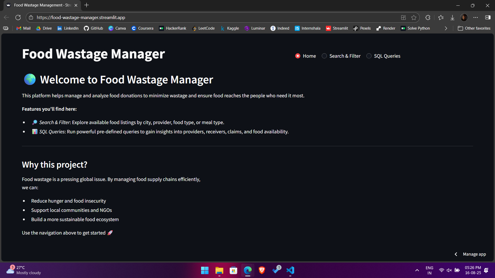
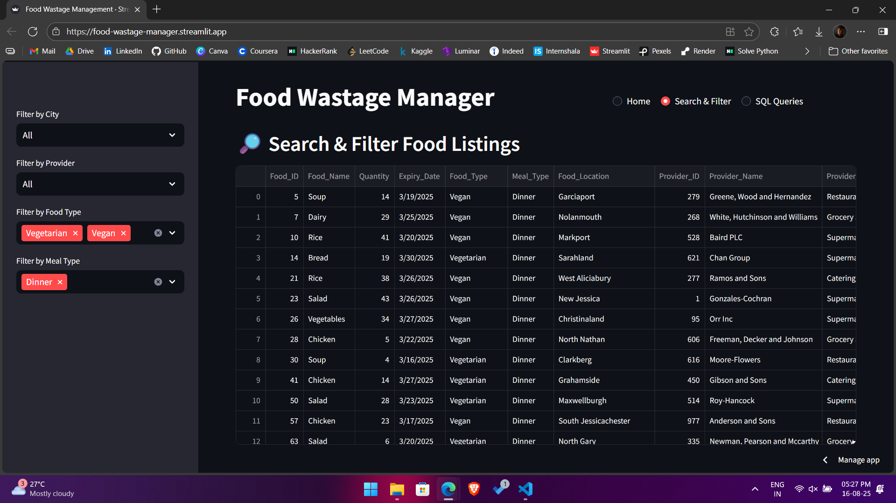
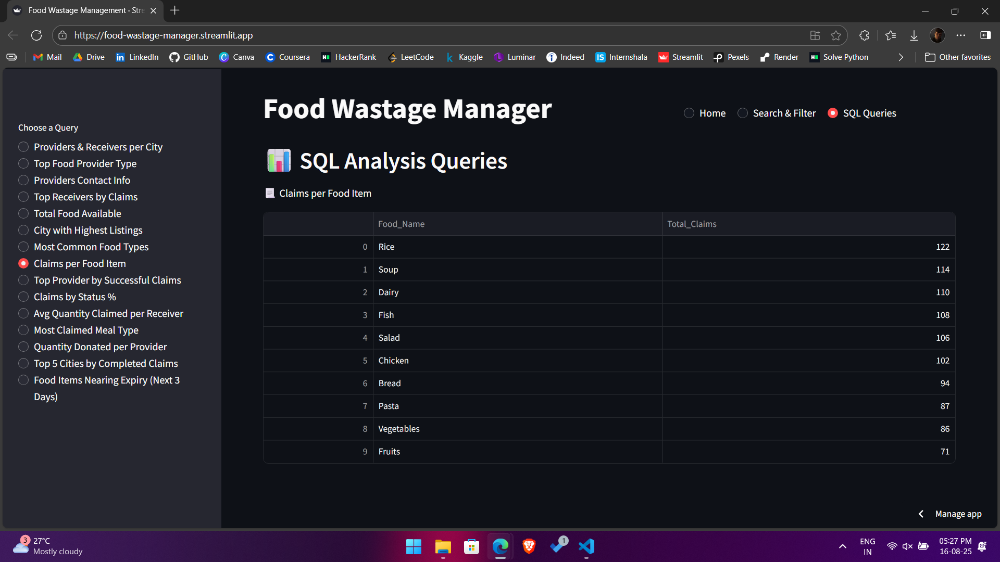

# 🍽️ Food Wastage Management App

A clean and interactive **Streamlit** web application designed to tackle food wastage by managing **food listings**, **providers**, and **claims**. Built with **SQLite**, **Streamlit**, and **Pandas**, this app allows users to **search/filter food availability** and run **predefined SQL analytics** for actionable insights.

---

## 🌐 Live App

🔗 [Try the app now](https://food-wastage-manager.streamlit.app)

---

## ⚡ Key Features

- 🔍 **Search & Filter Food** by city, provider type, food type, and meal type
- 📋 **View All Food Listings** with details like expiry date, location, and provider info
- 📊 **Predefined SQL Queries** for quick insights (e.g., top food types, most active providers, claims by status)
- 🏙️ **City-Level Insights** into donations and requests
- 🧾 **Claims Management** — track claimed, pending, or rejected donations
- 💻 Simple, responsive Streamlit interface

---

## 🌟 What Makes It Special?

**From Listings to Insights.**  
This app bridges the gap between **food donors** and **receivers** by offering a unified system to manage availability, reduce wastage, and support communities. Whether you’re a **provider**, **receiver**, or **analyst**, it provides instant insights into food flows.

---

## 🛠️ Tech Stack

| Tool      | Purpose                                  |
| --------- | ---------------------------------------- |
| Streamlit | Interactive Web UI framework             |
| SQLite    | Lightweight relational database          |
| Pandas    | Data querying & manipulation             |
| PyArrow   | Efficient dataframe display in Streamlit |

---

## 🖼️ Screenshots

- 
- 
- 

---

## 📊 Database Schema (Simplified)

- **providers** – details of food providers (id, name, type, city, contact)
- **receivers** – details of receivers (id, name, city, type)
- **food_listings** – food donations (id, name, quantity, expiry, food type, meal type, provider_id, location)
- **claims** – claims made by receivers (id, food_id, receiver_id, status)

---

## 👨‍💻 Author

**Vaisakh Nirupam**  
🔗 [LinkedIn](https://www.linkedin.com/in/vaisakh-nirupam)

---
